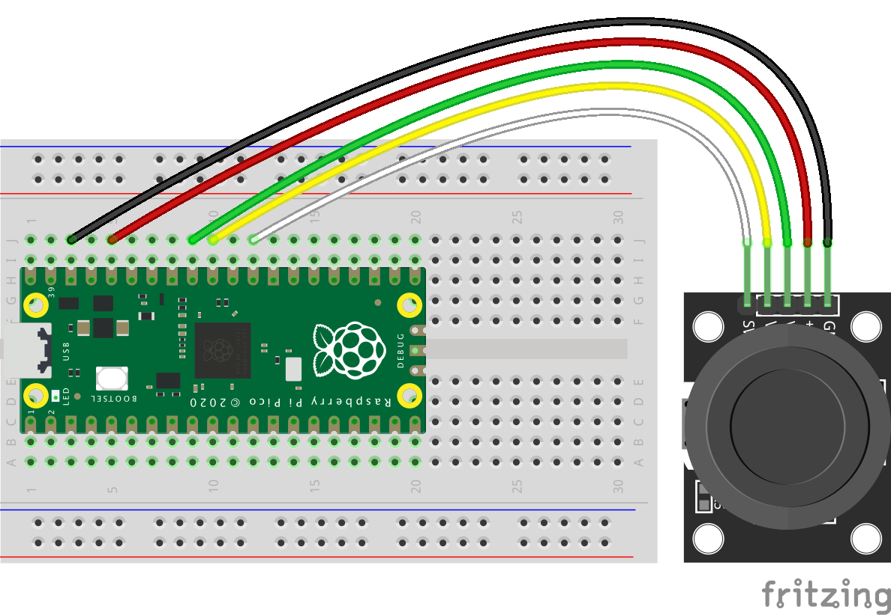

| Raspberry Pi Pico |                | KY-023 |
| ----------------- | -------------- | ------ |
| Pin 38            | GND            | GND    |
| Pin 36            | 3V3 OUT        | VCC    |
| Pin 32            | GPIO 27 (ADC1) | VRX    |
| Pin 31            | GPIO 26 (ADC0) | VRY    |
| Pin 29            | GPIO 22        | SW     |
```python
from machine import Pin, ADC
from time import sleep

# Initialisierung: GPIO25 als Ausgang
led_onboard = Pin(25, Pin.OUT, value=0)

# Initialisierung: Button
btn = Pin(22, Pin.IN, Pin.PULL_UP)

# Initialisierung: ADC0 (GPIO26)
adc0 = ADC(0)

# Initialisierung: ADC1 (GPIO27)
adc1 = ADC(1)

# Wiederholung (Endlos-Schleife)
while True:
    # LED status
    led_onboard.value(not btn.value())
    # ADC0 value
    x = adc0.read_u16()
    # ADC1 value
    y = adc1.read_u16()
	
    print('ADC0:', x)
    print('ADC1:', y)
    sleep(0.1)
```


Source: https://www.elektronik-kompendium.de/sites/raspberry-pi/2801251.htm
