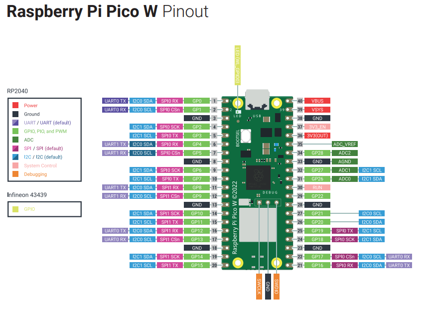

# The hardware: Raspberry Pi Pico 2

A tiny, inexpensive microcontroller board for real‑world I/O (sensors, LEDs, motors). Unlike a full Linux computer, the Pico 2 will run our programs bare‑metal: it starts your code seconds after power‑up and uses very little power. It great for learning embedded programming and make quick hardware prototypes.

The microcontroller has 40 General-Purpose Input/Output (**GPIO**) pins that allows it to interact with other devices and sensors. You will likely not use more than 10 in this workshop.

The board can be powered up via USB. For power-hungry application, we can use VBUS, but it's generally not recommended to power devices directly from the board. External supplies and switches have to be used.
There is a 3.3v logic limit; never put >3.3 V on a GPIO pin.



- **USB micro‑B**: powers the board and provides a programming/serial link.
- **BOOTSEL button**: hold while plugging in to enter storage/flash mode. You use this to flash firmwares. For this workshop, the boards were already flashed with MicroPython firmware to run Python code.
- **GPIO pins**: labeled **GP?**; also **3V3**, **GND**, and **VBUS/VSYS** pins.
- **On‑board LED**: accessible in MicroPython as Pin("LED").
  
# The software: MicroPython

A lightweight Python 3 implementation for microcontrollers. You write normal Python, with extra modules like machine for hardware. Two killer features:
- **Read-Eval-Print Loop (REPL)**: an interactive prompt to try code immediately.
- **Auto‑run**: save a script as main.py on the board to run at power‑up.

## First‑time setup

For our simple use cases, we will use the simple (Py)Thonny IDE.

1. Download the one that corresponds to your OS from https://thonny.org/
2. Select interpreter/port in Thonny → “MicroPython (Raspberry Pi Pico)” → your Pico’s serial port.

> **REPL shortcuts:** Ctrl+C stops a running script; Ctrl+D soft‑reboots.

To test if everything works, start with the following snippet (preferably without copy/paste as a warm-up):
```python
from machine import Pin
import time

led = Pin("LED", Pin.OUT)  # on‑board LED

while True:
    led.toggle()
    time.sleep(0.5)
```

- **Run it:** press **Run**. 
- To auto‑start on power‑up, save as **main.py** to the device, unplug-plug the board and check if the LED starts blinking immediately.


## Common gotchas

- **3.3 V only on GPIO** (5 V can damage pins). Use proper level shifting if needed.
- **Ground reference:** always share **GND** between Pico and external modules.
- **Busy loop vs. timers:** prefer timers/interrupts for precise or low‑power tasks.
- **File names:** boot.py (optional startup config) runs before main.py.

## Next steps (quick wins)

- **Blink patterns** with PWM for breathing LEDs.
- **Buttons and Control LED**.
- **OLED screen** via I²C: display text or sensor graphs.
